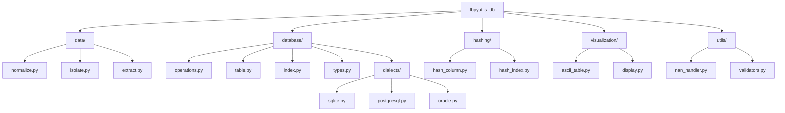

# Arquitetura Modular - fbpyutils_db v0.2.0

## Visão Geral

Este documento descreve a arquitetura modular do `fbpyutils_db` a partir da versão v0.2.0, que refatora o módulo monolítico anterior em componentes coesos e independentes. O objetivo é melhorar a manutenibilidade, extensibilidade e testabilidade do projeto, mantendo a retrocompatibilidade com warnings de deprecação até a v0.4.0.

## Objetivos da Refatoração

*   **Refatoração modular:** Divisão do código em módulos lógicos.
*   **Compatibilidade multi-banco:** Suporte nativo para SQLite3, PostgreSQL e Oracle.
*   **Manter retrocompatibilidade:** Funções antigas acessíveis com avisos de deprecação.

## Diagrama de Arquitetura



## Estrutura de Diretórios Final

```
fbpyutils_db/
├── __init__.py          # Retrocompatibilidade com warnings e importações diretas
├── data/
│   ├── __init__.py
│   ├── normalize.py     # Funções de normalização de dados (ex: normalize_columns)
│   ├── isolate.py       # Funções de isolamento de dados (ex: isolate)
│   └── extract.py       # Funções de extração de dados (ex: get_data_from_pandas)
├── database/
│   ├── __init__.py
│   ├── operations.py    # Funções de operações de banco de dados (ex: table_operation)
│   ├── table.py         # Funções de manipulação de tabelas (ex: create_table)
│   ├── index.py         # Funções de manipulação de índices (ex: create_index)
│   ├── types.py         # Mapeamento de tipos de dados (ex: get_columns_types, get_column_type)
│   └── dialects/
│       ├── __init__.py  # Lógica de detecção de dialeto e roteamento de queries
│       ├── sqlite.py    # Queries e lógica específica para SQLite
│       ├── postgresql.py# Queries e lógica específica para PostgreSQL
│       └── oracle.py    # Queries e lógica específica para Oracle
├── hashing/
│   ├── __init__.py
│   ├── hash_column.py   # Funções de hashing de colunas (ex: _create_hash_column, add_hash_column)
│   └── hash_index.py    # Funções de hashing de índices (ex: add_hash_index)
├── visualization/
│   ├── __init__.py
│   ├── ascii_table.py   # Funções para criação de tabelas ASCII (ex: ascii_table, print_ascii_table)
│   └── display.py       # Funções de exibição (ex: print_ascii_table_from_dataframe, print_columns)
├── utils/
│   ├── __init__.py
│   ├── nan_handler.py   # Funções para tratamento de valores NaN (ex: _deal_with_nans)
│   └── validators.py    # Funções de validação (ex: _check_columns)
├── tests/
│   ├── unit/            # Testes unitários (mockados, rápidos)
│   └── functional/      # Testes de integração com bancos reais (agnósticos ao engine)
├── pyproject.toml       # Configurações do projeto e dependências
├── README.md            # Informações gerais do projeto
├── DOC.md               # Documentação detalhada do código
├── TODO.md              # Lista de tarefas e próximos passos
└── app.json             # Configurações da aplicação (logger, env)
```

## Componentes Principais

*   **`__init__.py`**: Atua como o ponto de entrada principal do pacote, fornecendo retrocompatibilidade para chamadas de funções antigas através de avisos de deprecação e expondo as novas funções modulares para acesso direto.
*   **`data/`**: Contém módulos para manipulação e transformação de dados em DataFrames.
    *   `normalize.py`: Funções para normalização de colunas.
    *   `isolate.py`: Funções para isolamento de dados.
    *   `extract.py`: Funções para extração de dados de DataFrames.
*   **`database/`**: Gerencia operações de banco de dados e abstrações de dialeto.
    *   `operations.py`: Funções para operações de alto nível (upsert, replace, append).
    *   `table.py`: Funções para criação e manipulação de tabelas.
    *   `index.py`: Funções para criação de índices.
    *   `types.py`: Mapeamento de tipos de dados entre Pandas e SQLAlchemy.
    *   `dialects/`: Subpacote para lógica específica de cada dialeto de banco de dados.
        *   `__init__.py`: Lógica para detecção automática do dialeto e roteamento para as queries corretas.
        *   `sqlite.py`, `postgresql.py`, `oracle.py`: Implementações de queries SQL e lógicas específicas para cada banco.
*   **`hashing/`**: Contém funções para geração e manipulação de hashes.
    *   `hash_column.py`: Funções para adicionar colunas de hash.
    *   `hash_index.py`: Funções para substituir o índice do DataFrame por hashes.
*   **`visualization/`**: Módulos para visualização de dados.
    *   `ascii_table.py`: Funções para criar e imprimir tabelas ASCII.
    *   `display.py`: Funções para exibir dados de DataFrames em formato de tabela ASCII e imprimir colunas formatadas.
*   **`utils/`**: Módulos para funções utilitárias gerais.
    *   `nan_handler.py`: Funções para tratamento de valores nulos (NaN).
    *   `validators.py`: Funções para validação de dados e estruturas.

## Fluxo de Operação (Exemplo: `table_operation`)

1.  Uma chamada é feita para `fbpyutils_db.table_operation()`.
2.  O stub de deprecação em `fbpyutils_db/__init__.py` redireciona a chamada para `fbpyutils_db.database.operations.table_operation()`.
3.  `table_operation` utiliza o `engine` fornecido para chamar `fbpyutils_db.database.dialects.get_dialect_specific_query()` para obter a query SQL apropriada para o dialeto do banco de dados.
4.  A query é executada, e `_deal_with_nans` (importado de `fbpyutils_db.utils.nan_handler`) é usado para pré-processar os valores antes da inserção.
5.  `create_table` (importado de `fbpyutils_db.database.table`) e `create_index` (importado de `fbpyutils_db.database.index`) são chamados conforme necessário, utilizando `get_columns_types` e `get_column_type` (importados de `fbpyutils_db.database.types`) para mapeamento de tipos.

## Considerações Futuras

*   **Cobertura de Testes:** Aumentar a cobertura de testes unitários e funcionais para 90%+ em futuras releases.
*   **Otimização de Queries:** Refinar as queries específicas de cada dialeto para otimização de performance.
*   **Novos Dialetos:** Adicionar suporte para outros bancos de dados conforme a necessidade.
*   **Documentação Detalhada:** Expandir a documentação de cada módulo e função.
